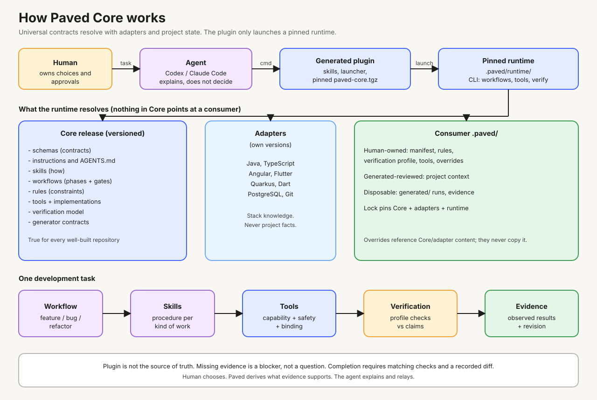
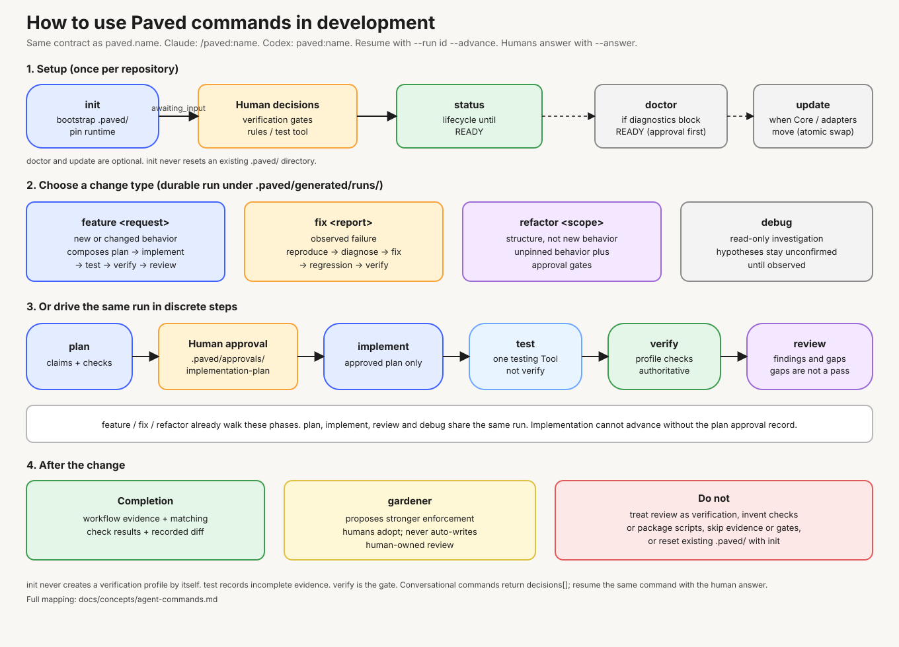

# Paved

**A reliable way to work with coding agents in real software repositories.**

Paved gives an AI coding agent the project context, constraints and work process it
needs, then checks that the work followed that process. It works with repositories
of different sizes and technologies, from a focused bug fix to a feature that spans
multiple modules.

## Why Paved exists

Coding agents can make useful changes quickly, but they often start without enough
knowledge of a repository. They may miss local conventions, choose the wrong test
command, skip a needed approval, or report success without showing what was checked.

Paved makes the expected way of working visible and repeatable. It discovers what it
can from the repository, asks people to resolve important choices, and keeps project
state and evidence in the repository. The agent does the engineering work; people
remain responsible for product decisions and approvals; Paved provides the shared
process and records its results.

Paved does not promise that software is defect-free. It makes the work, decisions,
checks and remaining gaps easier to inspect.

## How it works

1. **Initialize a repository.** Paved detects project modules and technologies,
   explains choices that need a person, and creates a project-local `.paved/` state.
2. **Understand the project.** Generated context describes the repository. People
   review it and can add project rules where needed.
3. **Describe the change.** Start with `intent` and your request. Paved classifies it
   as a feature, a bug fix or a refactor (or asks you), then `plan` and `execute` carry
   it out in phases.
4. **Review and verify.** Required approvals stay with the person. Paved runs the
   configured tests and verification checks and records evidence before a workflow
   can be completed.



Paved is agent-neutral at its core. Native plugins for Cursor, Codex and Claude Code expose
the same skills and activate a version-pinned runtime in the consumer repository.
The repository's `.paved/` state is the authority for that project's configuration
and runtime version.

## Get started

Install the plugin for your coding agent:

```bash
# Codex
codex plugin marketplace add andersonmrodrigues/paved
codex plugin add paved@paved

# Claude Code
claude plugin marketplace add andersonmrodrigues/paved
claude plugin install paved@paved
```

In Cursor, open **Customize → Plugins → From GitHub Repository**, import
`https://github.com/andersonmrodrigues/paved`, then install Paved.

Open the repository you want to work on and initialize Paved:

```text
Claude Code: /paved:init
Codex:       paved:init
Cursor:      /init
```

Then inspect its setup and start a change. For example:

```text
Cursor:      /status, /intent, /plan, /execute
Claude Code: /paved:status, /paved:intent, /paved:plan, /paved:execute
Codex:       paved:status, paved:intent, paved:plan, paved:execute
```

The launcher verifies and installs the plugin's bundled runtime under
`.paved/runtime/`; it does not add dependencies to your application. The full
[installation guide](docs/getting-started/installing-the-plugin.md) covers updates,
runtime upgrades, removal and troubleshooting. To configure project context and
verification, see [Integrating a repository](docs/getting-started/integrating-a-repository.md).

## Workflows and commands



Every change goes through three steps over one run. Paved keeps runs in the repository so
an agent can resume them and people can inspect plans, approvals and results.

| Command | Use it when… |
| --- | --- |
| `intent` | You want to change the repository. Pass your request as you would say it. Paved classifies it as a `feature`, a `bug` fix or a `refactor` from evidence, or asks you; a mixed request is split. It gathers context, and for a bug writes a failing regression test first, for a refactor records a passing baseline. |
| `plan` | The change is understood. The plan is written to `.paved/documents/plans/`, reviewed in the Markdown preview, and approved by you in the conversation. |
| `execute` | The plan is approved. Paved implements it, runs the tests and the verification profile, records evidence, opens the review in the preview and completes the run. New gardener proposals are listed as advice. |
| `preview` | You want to review a Markdown plan, spec or a folder of them (an epic and its tasks), commenting on selected text and following each comment until the agent resolves it. |

You can also use `status` to inspect readiness, open runs and diagnostics (and answer its
repair decisions), `init` to set up a repository, and `update` to apply a compatible local
Core update. `test`, `verify`, `doctor`, `gardener` and `generate` remain CLI subcommands for
CI and scripted use. Some operations depend on project configuration or approvals; Paved
reports when they are unavailable. See the [agent command reference](docs/concepts/agent-commands.md)
for inputs, behavior and availability conditions, and [migrating to 2.0](docs/getting-started/migrating-to-2.md)
if you used the 1.x commands.

## What Paved provides

- **Project context** generated from repository evidence and reviewed by people.
- **Skills and workflows** that give agents repeatable steps for common engineering work.
- **Adapters** that add technology-specific knowledge while keeping the Core general.
- **Explicit tools and verification** so commands are declared and checks are
  configured for the project.
- **Approvals and evidence** that preserve human decisions and show what was run.
- **Repository-owned state** that can be reviewed and versioned with the project.

Paved currently provides adapters for Git, Java, Quarkus, TypeScript, Angular, Dart,
Flutter and PostgreSQL. Supported integrations are Cursor, Codex and Claude Code. The set of
available commands and checks depends on each repository's detected technologies
and configuration.

## Who makes Paved

Paved was created by **Anderson Rodrigues** and is maintained in the open. Contributions
are welcome; see [Contributing to Paved](CONTRIBUTING.md) for the repository's
development setup and guidelines.

## Project status

The current Core release is the latest entry in the [changelog](CHANGELOG.md). The Cursor,
Codex and Claude Code plugins are available through this repository's GitHub-backed
marketplaces. Paved is not listed in public
agent plugin directories, and `paved-core` is not published to npm; the plugin bundles
the runtime it needs.

## Learn more

- [Install the plugin](docs/getting-started/installing-the-plugin.md)
- [Integrate a repository](docs/getting-started/integrating-a-repository.md)
- [Agent command reference](docs/concepts/agent-commands.md)
- [Conversational decisions](docs/concepts/decisions.md)
- [Architecture](docs/concepts/architecture.md)
- [Extensibility](docs/concepts/extensibility.md)
- [Contributing](CONTRIBUTING.md)
- [Changelog](CHANGELOG.md)
- [Security](SECURITY.md)
- [License](LICENSE)
