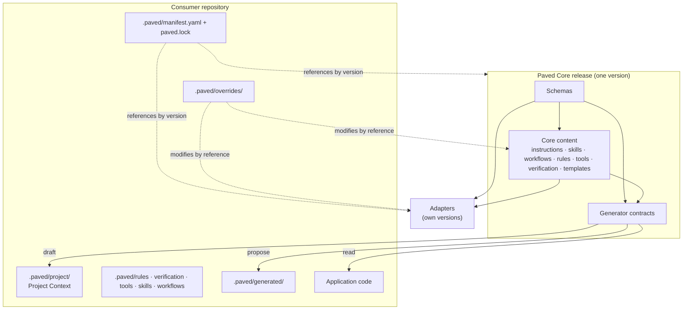
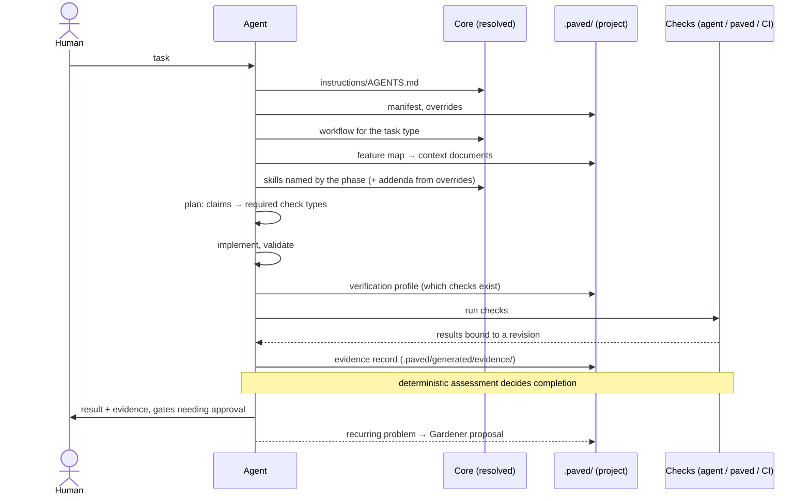
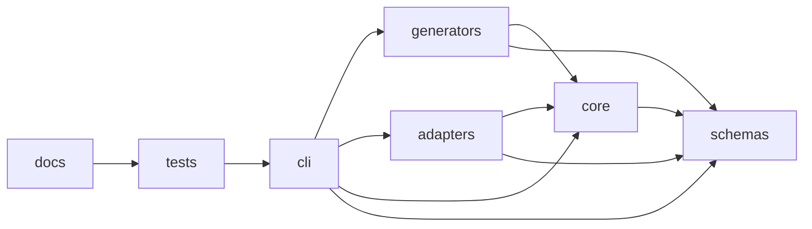

# Architecture

Paved separates what is universal, what is technology-specific and what is
project-specific, and connects them through versioned, machine-readable contracts. This
document is the entry point to the architecture; each section links to the document
that goes deeper. Decisions and their alternatives are in [decisions](../decisions/README.md).

## Layers

Arrows between boxes point from what depends to what it depends on, except the generator
arrows, which show data flow. Nothing in the Core or in an adapter points at a consumer.

| Layer | Contains | Lives in | Owned by | Changes when |
|---|---|---|---|---|
| **Core** | How agents work: instructions, principles, lifecycle, skills, workflows, rules, tool and verification models, schemas, templates, generator contracts | This repository | Paved maintainers | A Core release |
| **Adapter** | How a technology works: detection signals, knowledge, technology skills, rules, tools, check suggestions | `adapters/<category>/<name>/` | Adapter maintainers | An adapter release |
| **Project Context** | How this project works: architecture, domain, product, integrations, feature map | `.paved/project/` | Generated, then reviewed by the project's humans | The project's code changes |
| **Project configuration** | Project rules, verification profile, tools, skills, workflows | `.paved/{rules,verification,tools,skills,workflows}/` | The project | The project decides |
| **Override** | Reasoned modifications of Core or adapter content, by reference | `.paved/overrides/` | The project's humans | The project decides |
| **Generated** | Disposable output: proposals, generation state, evidence | `.paved/generated/` | Tools | Every run |

## What each concept is

**Core.** The versioned set of contracts and universal content every consumer inherits:
how an agent discovers context, plans, changes code, verifies and reports. It is
identical for every consumer at a given version and contains no knowledge of any
technology or domain. *Test:* a sentence belongs in the Core only if it is true for
every well-built repository.

**Adapter.** A versioned package of knowledge about one technology (a language,
framework, infrastructure or database), built from official sources. It adds skills,
rules, tools, knowledge and check suggestions. It never modifies Core content and knows
no project. See [ADR 0002](../decisions/0002-adapter-architecture.md).

**Project Context.** What is true of one repository: its architecture, domain, product,
integrations and feature map. Generators draft it from the code; humans review it. Every
statement has a state (known, inferred, unknown, conflicting, stale) and provenance.
See [traceability](traceability.md).

**Override.** A human decision, with a reason, to modify inherited content for one
project: change a rule's severity, disable a rule, skill or workflow, extend a skill
with an addendum, or add gates and required checks to a workflow. Overrides reference
their target; they never copy it. See [inheritance](inheritance.md).

**Generated data.** Anything a tool can recompute: generator
proposals, generation state and evidence records. It lives in `.paved/generated/`, is
not committed, and can be deleted at any time. Project Context is generated *and
reviewed*, which makes it a different category (`generated-reviewed`). See
[ownership and regeneration](ownership-and-regeneration.md).
Core cache materialization remains planned.

**Skill.** A reusable procedure for one kind of work (find a root cause, write a
regression test, review a change), in the [Agent Skills](https://agentskills.io/specification)
format plus a `skill.yaml` contract naming the context, tools, rules and checks it needs.
Skills say *how*; they never contain project facts.

**Workflow.** The phases one kind of task goes through (feature, bug, refactor…), in the
canonical lifecycle order, with the skills and check types each phase uses and the gates
that must hold before leaving it. `verification`, `evidence` and `completion` are never
omitted.

**Tool.** A versioned capability contract with typed inputs/outputs, permissions,
preconditions, environments, effects, safety (`read-only`, `safe-mutation`, `destructive`,
`high-impact`), idempotency and evidence behavior. A separate `ToolImplementation` binds
it to Core, adapter or project execution. Discovery does not grant permission; policy is
checked before resolution. The CLI library validates and captures results, while the
command runner remains future work.

**Verification.** The model that turns a change's claims into required check types, maps
them to the checks the project actually has (its verification profile), and runs them.
See [verification](verification.md).

**Evidence.** The record verification leaves behind: claims, the checks and artifacts
that support them, who observed each result and against which revision, gaps, rule
compliance and the completion decision. It separates what the agent says from what was
observed.

**Gardener.** The feedback loop. It detects recurring mistakes, drift and weak
enforcement, and proposes a fix at the strongest layer available (architecture, static
analysis, CI, rule, skill, documentation). It proposes; humans decide. See
[gardener](gardener.md).

## How they interact during a task

The context an agent loads grows with what it knows about the task; see
[context loading](context-loading.md).

## Components of this repository

The repository is split into components with an explicit dependency graph, declared in
`components` in the Core [manifest](../../manifest.yaml) and enforced by
`tests/core/boundaries.test.ts`. Details: [boundaries](boundaries.md).

Transitive edges are omitted; `depends_on` in the manifest lists them all.

`schemas`, `core` and `generators` are **distributed**: they form the Core release a
consumer references. `adapters`, `cli`, `docs` and `tests` are not.

## Machine-readable by default

Every concept has a contract that tooling can check:

| Concept | Human-readable | Machine-readable | Checked by |
|---|---|---|---|
| Skill | `SKILL.md` | `skill.yaml` | schema + reference checks |
| Workflow | `WORKFLOW.md` | `workflow.yaml` | schema + phase order + skill references |
| Rule | `rationale`, `rule` fields | rule YAML | schema; override checks |
| Tool | `purpose` | tool YAML with safety class | schema (safety invariants) |
| Verification | [verification](verification.md) | profile + check-type registry | schema + registry sync |
| Evidence | claims in prose | evidence YAML | schema + semantic assessment |
| Project Context | Markdown body | `ContextDocument` frontmatter, `Feature` YAML | schema |
| Generator | `GENERATOR.md` | `generator.yaml` | schema + write-permission check against the consumer layout |
| Consumer layout | [multi-repository](multi-repository.md) | `consumer_layout` in `manifest.yaml` | tests; later the CLI |
| Component boundaries | [boundaries](boundaries.md) | `components` in `manifest.yaml` | `tests/core/boundaries.test.ts` |

What is enforced today and what is only planned is listed in
[enforcement candidates](../maintenance/enforcement-candidates.md).

## Related

- [Boundaries](boundaries.md): components, dependency direction, consumer contract
- [Inheritance](inheritance.md): composition, overrides and precedence
- [Context loading](context-loading.md)
- [Traceability](traceability.md): source of truth, knowledge states, provenance, freshness
- [Verification](verification.md): claims, observations and evidence
- [Schemas](schemas.md), [contracts](contracts.md), [references](references.md): the
  machine-readable contracts, what they promise and how documents refer to each other
- [Gardener](gardener.md)
- [Multi-repository](multi-repository.md), [versioning](versioning.md),
  [repository lifecycle](repository-lifecycle.md), [failure handling](failure-handling.md),
  [extensibility](extensibility.md), [ownership and regeneration](ownership-and-regeneration.md)
- [Principles](../../core/instructions/principles.md)
