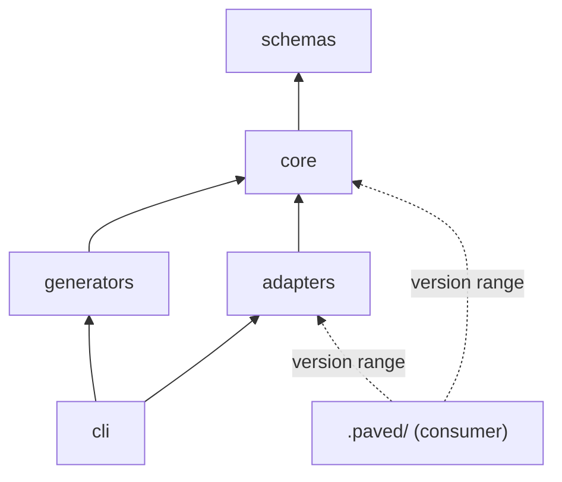

# Boundaries

Two kinds of boundary matter: between the components of this repository, and between
the Core and a consumer repository. Both are declared in the Core
[manifest](../../manifest.yaml) (`components`, `consumer_layout`) so tests and, later,
the CLI can check them.

## Components

| | `schemas/` | `core/` | `generators/` | `adapters/` | `cli/` | consumer `.paved/` |
|---|---|---|---|---|---|---|
| **Responsibility** | Contracts for every document kind | Universal agent behavior | Turning a repository into Project Context and proposals | Technology knowledge | Loading, validating, resolving, generating, verifying | Everything project-specific |
| **May depend on** | nothing | schemas | schemas, core | schemas, core | schemas, core, generators, adapters | Core and adapters, by version |
| **Must not depend on** | anything | generators, adapters, cli, docs, any consumer | adapters' content, cli, any consumer | other projects; cli | any single consumer | other consumers |
| **Owner** | Core maintainers | Core maintainers | Core maintainers | Adapter maintainers | Core maintainers | The project |
| **Lifecycle** | Core release | Core release | Core release | Own release | Own release (open decision) | The project's commits |
| **Versioning** | `apiVersion` (`paved/v1`) + Core SemVer | Core SemVer | Core SemVer; each generator has its own version, recorded in provenance | Adapter SemVer + `requires.core` | Declares the Core range it implements | Declares ranges; lock records exact versions |
| **Extended by** | New kind, new optional fields | New skills, workflows, rules, tools, check types | New generator directory | New adapter directory | New command (no plugins) | `.paved/` files and overrides |

`docs/` and `tests/` are components too: they may reference everything above, and
nothing distributed references them.

"May depend on" means: may link to (Markdown), import (TypeScript) or rely on the
contracts of. The distributed components (`schemas`, `core`, `generators`) form the
Core release, so they can depend only on each other; a Core release must be usable
without the CLI, the docs or any adapter. A plain-text mention of a maintainer document
(for example a schema description saying "see docs/concepts/inheritance.md") is a
pointer into the Core repository for maintainers, not a dependency: nothing in the
distributed component needs it to work, and the test does not count it.

## Dependency direction

Rules that follow from it:

1. **No cycles.** The component graph is a DAG.
2. **Nothing depends on a consumer.** No Core, adapter or generator content names a
   project id (`project.*`), path or fact.
3. **The Core does not know adapters.** Core content references no `adapter-*` id and
   no technology. Adapters are optional; a Core without any adapter is complete.
4. **Adapters do not know projects** and do not know each other except through
   `requires.adapters`.
5. **Generators read the consumer; they do not depend on it.** A generator's contract
   is written against the consumer *layout*, not against any particular repository.

## Enforcement

`tests/core/boundaries.test.ts` checks, on every run:

| Check | Catches |
|---|---|
| Every top-level directory is a declared component | A new directory with no declared dependencies |
| `depends_on` names existing components and is acyclic | Cycles |
| Distributed components depend only on distributed ones | The Core release needing the CLI or docs |
| Markdown links and TypeScript imports cross components only along `depends_on` | Undeclared coupling, for example `core/` linking to `docs/` |
| Core skills, workflows, rules and tools contain no `project.*` or `adapter-*.*` ids | The Core depending on a layer above it |
| Adapter YAML contains no `project.*` ids | An adapter written for one project |

What the test cannot see (a Core sentence that is only true for some technology, a skill
that assumes a domain) remains a review concern; see
[enforcement candidates](../maintenance/enforcement-candidates.md).

## The consumer boundary

The consumer contract is the `consumer_layout` in the Core manifest: every path, its
ownership, whether it is required, and which schema its documents follow. The
[multi-repository](multi-repository.md) document explains it path by path.

| Category | Paths |
|---|---|
| **Mandatory** | `.paved/manifest.yaml` (the only required file) |
| **Optional** | everything else; a repository can adopt Paved one directory at a time |
| **Generated** | `.paved/project/` (generated, then reviewed), `.paved/generated/` (disposable) |
| **Human-owned** | `.paved/manifest.yaml`, `.paved/overrides/`, `AGENTS.md` outside the Paved block |
| **Project-owned** | `.paved/rules/`, `verification/`, `tools/`, `skills/`, `workflows/`, `documents/` |
| **Inherited** | Core and adapter skills, workflows, rules, tools, verification model |
| **Extendable** | Inherited content through overrides; project content by adding files |
| **Regenerable** | `.paved/project/` (preserving human edits), `.paved/generated/` (freely), `.paved/paved.lock` (deterministically) |

A generator may write only `generated-reviewed` and `disposable` paths; a test enforces
this against every generator contract.
