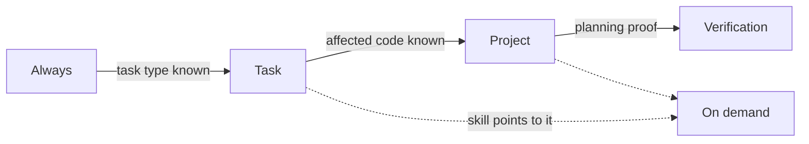

# Context loading

An agent's context window is small and expensive, and irrelevant context makes it worse
at the task. Paved therefore loads context in tiers, each triggered by something the
agent has just learned (principle 8, progressive disclosure). The agent-facing version
of this table is in `core/instructions/AGENTS.md`.

## Tiers

| Tier | Trigger | Loads | Typical size |
|---|---|---|---|
| **Always** | Any task in the repository | Repository `AGENTS.md` Paved block; Core `instructions/AGENTS.md`; `.paved/manifest.yaml` | A few hundred lines |
| **Task-dependent** | The kind of task is known | One workflow (`WORKFLOW.md`) and `instructions/workflows.md`; the skills its phases name, as each phase begins; addenda from overrides | One workflow, one skill at a time |
| **Project-dependent** | The affected code is known | Feature-map entries for that code; the context documents they link; project rules whose `applies_to` matches | Only the features touched |
| **Verification-dependent** | Planning the proof, then verifying | `.paved/verification/profile.yaml`; the Core verification model; `templates/evidence.yaml` | One profile |
| **On demand** | A skill or document says so | Skill `references/`; adapter knowledge for a detected technology; `principles.md`, `lifecycle.md` | As needed |

## Rules

1. **Each layer points to the next.** No document requires loading everything; every
   document says what to read next and when.
2. **Context is found by code location, not by search.** The feature map connects code
   paths to context documents, so an agent loads the context for the code it touches.
   `context-discovery` is the fallback when the map does not cover the code.
3. **Skills name what they need.** `skill.yaml` lists the context areas, rules and tools
   a skill uses, so a runner can preload exactly those later. The Core manifest's
   `context_areas` says where each area lives. Levels within a skill:
   [progressive disclosure](progressive-disclosure.md).
4. **Knowledge states travel with the content.** A context document's frontmatter says
   whether it is observed, declared or inferred, what is unknown and what conflicts.
   The agent reads the state with the statement (see [traceability](traceability.md)).
5. **Nothing from other repositories.** A consumer's context never loads another
   consumer's `.paved/` (see [multi-repository](multi-repository.md)).

## What is deliberately not loaded

- The full Core. Agents read the resolved Core on demand; they do not preload all skills.
- All Project Context. Architecture and domain documents are loaded when the feature map
  or a skill points at them, not by default.
- Generated state and old evidence. They are for tools and reviewers.

Measuring whether agents actually follow this order requires a runner that logs what is
read; until then it is guidance.
