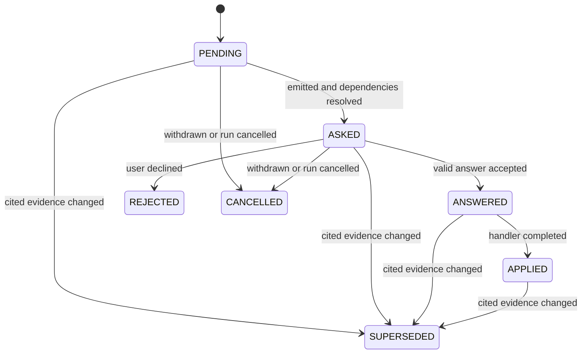

# Conversational decisions

Paved uses decisions when a project choice changes what commands write or execute. The
decision contract is shared by the CLI, workflow runs and agent projections. Agents
present Paved's question and relay the user's answer; they do not choose or invent answers.

## Classification

Every condition follows one of three policies:

| Category | Meaning | Result |
|---|---|---|
| `deterministic` | Evidence supports one safe interpretation | Paved resolves it and records provenance in its existing store. It may appear as an applied decision projection, but does not create a Decision file. |
| `material` | Several valid choices remain and project intent determines the right one | Paved emits a Decision and waits when an answer is required. Optional decisions are surfaced without blocking. |
| `unsafe` | Available evidence cannot establish that proceeding is safe | Paved returns a blocking diagnostic. It does not make the unsafe condition answerable. |

A diagnostic is a fact about an unmet prerequisite or safety condition, not a question.
A user answer cannot create a missing ToolImplementation, prove compatibility or bypass
an integrity check. If a command also has an independent optional decision, answering it
does not resolve the blocker unless Paved reports that outcome.

## Record and states

A persisted Decision is a `paved/v1` `Decision` contract. Its content-derived id is stable
for the same question, scope and candidate set. The record carries its command, scope,
authorship, reason, options, recommendation, evidence, answer contract, effect-derived
risk and answer channel, status and narrow fingerprint.



`PENDING` is not presented. `ASKED` is the only state that accepts an answer. `ANSWERED`
is durable before mutation so a retry can recover a crash. `APPLIED` records completed
changes. `REJECTED`, `CANCELLED` and `SUPERSEDED` are terminal; a changed question is
emitted as a successor linked with `supersedes`.

The fingerprint covers only the Decision's own evidence references and candidate set.
Unrelated repository changes do not invalidate a decision. When cited evidence or
candidates change, Paved supersedes the old record and asks the new question again.
If a runtime update replaces the question for the same apply handler, the next
run of the originating command also supersedes the old pending decision before
presenting the replacement. A previous option id cannot answer the new question.

## Persistence and ownership

| Decision scope | Store | Ownership |
|---|---|---|
| Deterministic, project configuration | Existing authority such as `.paved/paved.lock` and generated provenance | Existing store; no Decision record is synthesized |
| Material, project | `.paved/decisions/<id>.yaml` | Tool-managed, committed with the project |
| Material, workflow run | `decisions[]` inside `.paved/generated/runs/<run-id>.yaml` | Disposable with its run |

Paved does not fabricate human answers for existing valid configuration. A hand-written
verification profile or explicit provider selection stays authoritative without a
retroactive Decision record. Project decisions are scanned from their directory; no index
is needed. Run decisions disappear with their disposable run.

## Answer channels

The registered apply handler determines the effect class, risk and channel; a decision
cannot lower its own requirements.

| Channel | What it proves | How it is supplied |
|---|---|---|
| `relayed` | A person gave the agent this answer; Paved records the supplied identity but does not authenticate it | Resume the originating command with `--answer <id>=<value> --answered-by <identity>` |
| `human-authored` | A person authored an approval record for this exact decision and answer | A person creates `.paved/approvals/<id>.json`, bound to the decision digest; the agent must not write it |

`--answered-by` must be an identity supplied by the user. Reserved identities such as
`agent`, `paved` and `ci` are rejected. A human-authored channel is used for irreversible
repository mutations and destructive effects. Plan approval remains a separate
human-authored gate tied to the plan digest.

## Answering and batching

Paved returns decisions at the top level of the command result. Present all emitted
questions together, including Paved's reason, every option and consequence, recommendation
and cited evidence. Only `dependsOn` creates an order; independent questions can be
answered in one command invocation.

Use the same command that raised each project decision:

```sh
paved verify --answer d-0123456789abcdef0123=all --answered-by user@example.com
```

Repeat `--answer` for each decision. For a `multi-choice` decision, repeat it for each
selected option; commas are not split. Workflow decisions resume on the same command and
run id, for example `paved execute --run <id> --advance --answer <decision-id>=<value>
--answered-by <identity>`.

Invalid answers leave the decision `ASKED`. Replaying the same answer is idempotent;
a different answer requires `paved decision revise <id> --reason <text>`. Paved validates
every value against the listed option ids and answer contract. Free text is data only and
cannot become a command argument or path.

## CLI surface

- `--answer <id>=<value>` is repeatable; `--answered-by <identity>` is required with it.
- `paved decision list [--run <id>]` lists stored decisions.
- `paved decision show <id>` displays a record.
- `paved decision revise <id> --reason <text>` supersedes a record and asks again.
- `paved decision raise --decision <json>` accepts a validated agent-authored question;
  it cannot route around a decision Paved already emitted.
- No TTY prompt is used. A required question returns `status: "awaiting_input"` and exit
  code `10`; optional questions accompany a normal success or warning result.

The originating command applies accepted answers and continues. See the
[canonical decision skill](../../core/skills/decisions/decisions/SKILL.md) for agent rules
and [ADR 0028](../decisions/0028-conversational-decision-resolution.md) for rationale.
