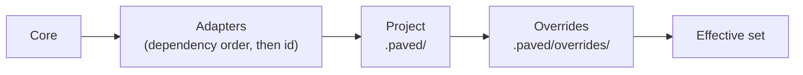

# Inheritance and overrides

A consumer inherits Core content and the content of the adapters it selects, adds its
own, and modifies inherited content only through overrides. This document defines how
the effective set of skills, workflows, rules and tools is computed (for skills in
particular, see [skills](skills.md#customization)). Decision record:
[ADR 0003](../decisions/0003-composition-and-overrides.md).

## Composition

1. **Core** content at the locked version.
2. **Adapters** in topological order of `requires.adapters`, ties broken by id. Adapters
   only *add* skills, rules, tools, knowledge and check suggestions.
3. **Project** content from `.paved/rules/`, `skills/`, `tools/`, `workflows/`. The
   project only *adds*.
4. **Overrides** from `.paved/overrides/overrides.yaml`, the only place that modifies
   inherited content.

The order is deterministic, so every agent and CI run computes the same effective set
from the same lock file.

## Identity, not position, decides

Paved has no shadowing. Identities never collide across layers: rules, tools, skills and
workflows have qualified ids whose first segment names the layer (`core.*`,
`adapter-<name>.*`, `project.*`; see [references](references.md)).

Short skill and workflow names must also be unique in the *effective* set, because agents
discover skills by name. A project skill with the same short name as an active Core
skill is an error, not a replacement; once the Core skill is disabled, the name is free.

Because nothing can be redefined by adding a file with the same name, the only
precedence rule is: **an override beats the default it targets.** A later layer never
silently wins over an earlier one.

## Override operations

| Target | Operation | Effect | Constraint |
|---|---|---|---|
| Rule | `set-severity` | Changes severity (`error`, `warning`, `info`), optionally only for `applies_to` paths | Not for `overridable: false` |
| Rule | `disable` | The rule does not apply, optionally only for `applies_to` paths | Not for `overridable: false` |
| Skill | `extend` | An addendum (a project Markdown file) is read after the skill | Addendum required |
| Skill | `disable` | The skill is not offered | |
| Workflow | `extend` | Adds gates to phases (same shape as workflow gates, including `when` and `approval`) and makes profile checks mandatory | At least one gate or check |
| Workflow | `disable` | The workflow does not apply | |
| Tool | `disable` | The inherited capability cannot be resolved | Project may add a separate capability |
| Tool | `restrict` | Narrows environments, timeout or retries; may require approval | Never widens contract policy |
| Tool | `select-implementation` | Selects one compatible implementation binding | Contract meaning and policy remain fixed |

Every entry names its `target` by qualified id, an `owner` (the person or team
accountable for the exception) and a `reason`. A Tool override may disable an inherited
capability, restrict its environment/timeout/retry policy, require approval, or select a
compatible implementation. It cannot change the capability contract, add permissions,
or loosen Core policy. Overrides never target `project.*` content; the project edits its
own files. Schema: `schemas/override.schema.yaml`.

## The questions, answered

**How does a project override a Core skill?** It cannot replace it. It `extend`s it with
an addendum, or `disable`s it and adds a project skill (which may reuse the short name). The
addendum refines; the agent still reads the Core skill first.

**How does a project disable a rule?** With a `disable` override and a reason, unless the
rule is `overridable: false` (Core safety rules: secrets, evidence, boundaries,
unknowns). `applies_to` narrows the exception to specific paths.

**How does an adapter add rules?** In its own `rules/` directory with `adapter-<name>.*`
ids. It cannot modify or disable Core rules or other adapters' rules; an adapter that
disagrees with a Core rule is wrong about the Core or the Core is wrong, and either is
fixed at its source.

**How does a project add rules?** In `.paved/rules/<category>/<name>.yaml` with
`project.*` ids. Project rules add constraints; they cannot relax inherited ones except
through an override.

**Can a workflow be replaced or extended?** Extended through an override (`add_gates`,
`require_checks`). Replaced by disabling it and adding a project workflow in
`.paved/workflows/`. Adapters cannot add workflows in `paved/v1`: a technology
changes how phases are carried out (skills, checks), not which phases a task has.

**What happens when the Core changes?** Overrides record the digest of their target
(`target_sha256`). When the target changes after an update:

| Operation | Behavior while the digest mismatches |
|---|---|
| `disable`, `set-severity` (subtractive) | **Not applied.** The target applies as the Core defines it. |
| `extend` (additive) | Applied, and reported for review. |

`paved update` and `paved status` report the override as *needs review*; a human
re-confirms it (the CLI then records the new digest) or removes it. This follows
principle 11: when Paved cannot tell whether an exception still makes sense, it falls
back to the stricter behavior. Overrides written without a digest are applied, and
`paved doctor` warns that they cannot be checked for drift.

**How are conflicts detected?**

| Conflict | Detection | Result |
|---|---|---|
| Same short skill or workflow name active in two layers | Composition | Error |
| Id with the wrong namespace for its layer | Schema (format) + path check | Error |
| Reference to an artifact outside the layer's visibility | `resolveReferences` | Error |
| Override targets something that does not exist (removed or renamed) | `resolveReferences` | Error; the override is never silently dropped |
| Override targets project content | `resolveReferences` | Error |
| Override targets an `overridable: false` rule | Composition (and a Core test for the template) | Error |
| Two overrides for the same target | Composition | Error |
| Override target changed since it was written | `target_sha256` | Needs review (see above) |
| A project rule that contradicts an inherited rule | Not mechanically detectable | Both apply. Rules are conjunctive, so the stricter one wins in practice; review should catch the contradiction |

Reference checks are implemented in `cli/lib/references.ts`. `paved doctor` and
`paved update` validate override schema, target kind and identity, selected adapter
availability, target digest, protected rules, duplicate targets and selected Tool
implementations. Full effective-set composition and short-name collision checking
remain contract-only (see [enforcement candidates](../maintenance/enforcement-candidates.md)).

## Precedence summary

| Effective… | Computed as |
|---|---|
| Rules | Core ∪ adapters ∪ project; then overrides (severity, disable) |
| Skills | Core ∪ adapters ∪ project; then overrides (extend, disable); short names unique in the result |
| Workflows | Core ∪ project; then overrides (extend, disable); short names unique in the result |
| Tools | Core ∪ adapters ∪ project; restrictive overrides may disable, constrain or select an implementation |
| Checks | The profile lists available check ids. Workflows and skills name check *types*; each Check references a Tool capability, whose implementation resolves separately |
| Knowledge | Adapter knowledge for how a technology works; Project Context for how this project uses it. When they disagree, the project's code decides (see [traceability](traceability.md)) |
