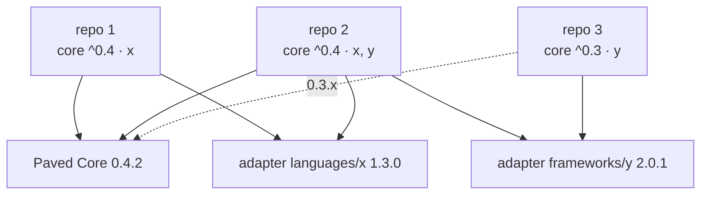

# Multi-repository architecture

This is the contract between the Paved Core and every repository that uses it. The
machine-readable version is `consumer_layout` in the Core [manifest](../../manifest.yaml);
this document explains it.

## Consumer layout

```text
consumer-repository/
├── AGENTS.md                 # human-owned; contains a delimited Paved block
├── .paved/
│   ├── manifest.yaml         # human-owned: project, Core range, adapters
│   ├── paved.lock            # tool-managed: exact resolved versions (committed)
│   ├── project/              # generated + reviewed: Project Context
│   │   ├── architecture/
│   │   ├── domain/
│   │   ├── product/
│   │   ├── integrations/
│   │   ├── technology/
│   │   └── feature-map/      # one Feature document per feature
│   ├── rules/                # project-owned: project.* rules
│   ├── verification/         # project-owned: profile.yaml and material
│   ├── tools/                # project-owned: project tool contracts
│   ├── skills/               # project-owned: project skills
│   ├── workflows/            # project-owned: project workflows (new names only)
│   ├── overrides/            # human-owned: overrides.yaml and addenda
│   └── generated/            # disposable, not committed
│       ├── core/             #   resolved Core cache (read-only)
│       ├── proposals/        #   generator output awaiting human adoption
│       ├── state/            #   last generated output, for three-way diffs
│       └── evidence/         #   evidence records
└── <application code>
```

Only `.paved/manifest.yaml` is required. Everything else is optional, so a repository
can adopt Paved one directory at a time. The consumer contract by category (mandatory,
generated, human-owned, inherited, extendable, regenerable) is in
[boundaries](boundaries.md#the-consumer-boundary).

## What the consumer does not do

- **It does not copy the Core.** It declares a compatible Core range in
  `.paved/manifest.yaml`; the CLI resolves the exact version into `.paved/paved.lock`
  and materializes a read-only cache in `.paved/generated/core/`. The cache is a
  derived artifact, never edited and not committed by default.
- **It does not edit Core or adapter content.** Adjustments go through overrides.
- **It does not put project knowledge anywhere but `.paved/`** (plus its own code and
  documentation, which remain the primary source of truth).

## Layer semantics

**Core.** Universal, maintained by Paved, identical for every consumer at a given version.

**Adapter.** Reusable knowledge about a technology, versioned on its own, selected per
project in the manifest.

**Project Context.** Knowledge specific to the project, drafted by generators and
reviewed by the project's humans. Lives in `.paved/project/`, committed with the code.

**Override.** An explicit, reasoned modification of Core or adapter content, by
reference: change a rule's severity or disable it; extend a skill with an addendum or
disable it; add gates or required checks to a workflow, or disable it. Schema:
`schemas/override.schema.yaml`. Rules with `overridable: false` cannot be overridden.
Overrides never contain copies. Semantics: [inheritance](inheritance.md).

**Generated.** Derived automatically and safe to delete: `.paved/generated/`. Project
Context is generated too, but it is *reviewed* and therefore not disposable; see
[ownership and regeneration](ownership-and-regeneration.md).

## Resolution order

How "the effective set" of rules, skills, workflows, tools and checks is computed is
defined in [inheritance](inheritance.md#precedence-summary).

## Where knowledge goes

| Question | Answer |
|---|---|
| Is it true for every repository? | Core |
| Is it true for every repository using a technology? | Adapter |
| Is it true for this repository only? | Project (`.paved/`) |
| Does it change a Core or adapter default for this project? | Override |
| Can it be recomputed from other files? | Generated |

## Many repositories, one Core



The design choices that let this scale to hundreds of repositories:

- **Pull, not push.** Each repository declares a range and updates when it chooses
  (`paved update`). The Core never writes to consumers, so a Core release cannot break a
  repository that has not updated. A fleet-wide rollout is many independent updates,
  which can be automated per repository (for example a scheduled update PR).
- **Locked resolution.** `.paved/paved.lock` pins exact versions and digests, so all
  agents and CI runs in one repository use the same Paved, whatever was released since.
- **No copies.** Consumers hold only their own knowledge. A Core fix reaches every
  repository on its next update, instead of being re-applied to hundreds of forks.
- **Validation is local.** Everything a repository needs to validate itself is the
  locked Core plus its own `.paved/`. No central service is required at runtime.
- **Overrides are countable.** Because modifications live in one file with reasons,
  maintainers can survey which Core rules are most often relaxed across repositories and
  treat that as a Gardener signal for the Core.

## What does not cross repository boundaries

- **Project Context.** A repository's context describes that repository. Paved does not
  load another consumer's `.paved/`, even when the repositories interact. An
  integration is described from each side, in each repository's `integrations/`
  context, and disagreements between the two are a human concern.
- **Overrides and project rules.** They apply to the repository that declares them.
  Shared organization-wide conventions belong in an adapter-like package (see
  [extensibility](extensibility.md)), not in copied `.paved/` files.
- **Evidence.** It is about one change in one repository.

Cross-repository knowledge (service maps, shared contracts, organization policy) is a
real need, deliberately not addressed in `paved/v1`. It is listed as an open decision in
the [architecture review](../getting-started/architecture-review.md).
