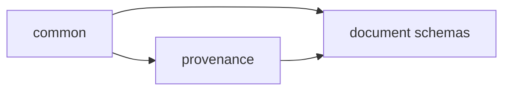

# Schemas

Every Paved document has a JSON Schema in `schemas/`. This page lists them, explains how
they are built and how validation is layered. What each contract means is in
[contracts](contracts.md); how documents point at each other is in
[references](references.md); how schemas change over time is in
[versioning](versioning.md). Format decision: [ADR 0008](../decisions/0008-schema-format.md).

## Catalog

| Schema | Kind(s) | Document |
|---|---|---|
| `manifest` | `Core`, `Project` | `manifest.yaml` here; `.paved/manifest.yaml` in a consumer |
| `lock` | `Lock` | `.paved/paved.lock` |
| `adapter` | `Adapter` | `adapter.yaml` of an adapter package |
| `skill` | `Skill` | `skill.yaml` next to a `SKILL.md` |
| `workflow` | `Workflow` | `workflow.yaml` next to a `WORKFLOW.md` |
| `workflow-run` | `WorkflowRun` | `.paved/generated/runs/<id>.yaml` |
| `rule` | `Rule` | One rule per file |
| `tool` | `Tool` | One tool contract per file |
| `verification` | `VerificationProfile` | `.paved/verification/profile.yaml` |
| `evidence` | `Evidence` | One record per change |
| `feature` | `Feature` | Entries of the feature map |
| `project-context` | `ContextDocument` | Frontmatter of `.paved/project/**/*.md` |
| `override` | `Overrides` | `.paved/overrides/overrides.yaml` |
| `generator` | `Generator` | `generator.yaml` of a generator |
| `generated-artifact` | `GeneratedArtifact` | `<file>.paved.yaml` sidecar of a generated file |
| `provenance` | — (shared definition) | The `provenance` block embedded in other documents |
| `common` | — (shared definitions) | Identifiers, references, versions, paths, dates, enums |

`manifest.yaml` maps each kind to its schema (`schemas`) and lists the shared definition
files (`schema_definitions`). `cli/lib/schemas.ts` holds the same mapping; a test keeps
them equal.

## Format

- JSON Schema **draft 2020-12**, authored in YAML for readability and comments.
- `$id` is `urn:paved:schema:<file-name>:v<N>`; the major matches the document API
  version.
- Every document starts with `apiVersion: paved/v<N>` and `kind: <Kind>`, the
  Kubernetes convention for self-describing documents.
- Objects are closed (`additionalProperties: false`) unless a field is explicitly a map.
  A typo is an error, not an ignored field.
- Ajv runs in strict mode: unknown keywords, keywords that do not apply to the declared
  type and ambiguous unions are schema bugs and fail the test suite.

## Composition

Schemas are composed with `$ref`; nothing is copied between files.

- `common.schema.yaml` holds primitives used by several schemas: `apiVersion`, `semver`,
  `semverRange`, `sha256`, `relativePath`, the qualified reference formats (`ruleRef`,
  `toolRef`, `skillRef`, `workflowRef`), `adapterId`, `generatorId`, `checkType`,
  `contextArea`, `changeType`, `unknown`, `conflict`, `fileRef`.
- `provenance.schema.yaml` is the only definition of provenance. `feature`,
  `project-context` and `generated-artifact` embed it; `evidence` reuses its `source`
  definition for artifact locations.
- Shared definitions never reference document schemas, so the `$ref` graph between files
  is acyclic (tested).
- A document schema may narrow a shared definition in place (for example the sidecar
  forbids `generator: human`) but never redefines it.

## Principles

| Principle | How the schemas apply it |
|---|---|
| Explicit | Every document names its `apiVersion` and `kind`; closed objects; required fields for everything a tool needs |
| Deterministic | No field whose meaning depends on the reader; enums instead of free text where a tool branches on the value |
| Extensible | New optional fields and enum values are additive ([versioning](versioning.md)); check types accept `x-` extensions; adapters and projects add artifacts in their own namespaces |
| Validatable | Every constraint that can be written in JSON Schema is; the rest is listed as a library check or a planned CLI check ([contracts](contracts.md)) |
| Traceable | One provenance definition, cited by id from blocks and conflicts; evidence binds every observation to a revision and a recorder |
| Progressive disclosure | Short required core per document; optional detail (lines, hashes, environment) where it is useful |
| Human-readable | YAML, descriptions on non-obvious fields, no generated ids |

## Validation layers

Validation runs in this order; each layer assumes the previous one passed.

| Layer | Question | Implemented in | Status |
|---|---|---|---|
| 1. Version | Can this Core read this `apiVersion`? | `checkApiVersion` in `cli/lib/schemas.ts` | Implemented |
| 2. Schema | Is the document well formed? | Ajv, `cli/lib/schemas.ts` | Implemented |
| 3. Reference | Does every qualified id exist, in a namespace the document may use? | `cli/lib/references.ts` | Implemented; needs the effective set from the CLI |
| 4. Semantic | Is the content coherent? (evidence support and revisions, cited sources, managed blocks) | `cli/lib/evidence.ts`, `cli/lib/provenance.ts` | Implemented for evidence and provenance |
| 5. Compatibility | Do Core, adapters and project agree on versions? | `paved status`, `doctor` and `update` | Implemented by consumer resolution and lock checks |
| 6. Provenance freshness | Do recorded hashes still match the sources? | `paved status` and `update` | Implemented for recorded generator inputs and locked content |

A document that passes all layers is **well formed and internally consistent**. That is
not the same as correct: no layer checks that a rule is wise, a feature description is
true, or a test actually exercises the claim it supports. Those need review.

## Influences

| Source | What Paved takes from it |
|---|---|
| [JSON Schema 2020-12](https://json-schema.org/draft/2020-12) | Dialect, `$id`/`$ref` composition, `$defs`, conditional `if/then` |
| [Semantic Versioning 2.0.0](https://semver.org/spec/v2.0.0.html) | Versions of the Core, adapters and generators; npm-style ranges |
| [Kubernetes API conventions](https://github.com/kubernetes/community/blob/master/contributors/devel/sig-architecture/api-conventions.md) | `apiVersion` + `kind`, one API version for a group of document kinds, additive changes within a version |
| [Agent Skills specification](https://agentskills.io/specification) | `SKILL.md` frontmatter stays exactly as the specification defines; Paved metadata lives in `skill.yaml` next to it |
| YAML frontmatter (Jekyll/Hugo convention) | `ContextDocument` metadata in the frontmatter of Markdown documents |
| [in-toto](https://in-toto.io/) and [SLSA provenance](https://slsa.dev/spec/v1.0/provenance) | Observations bound to a subject revision; trust depends on who recorded them |
| Schema evolution practice (Protocol Buffers, Avro) | Never reuse a removed field name with a new meaning; readers reject what they do not understand rather than guess |
