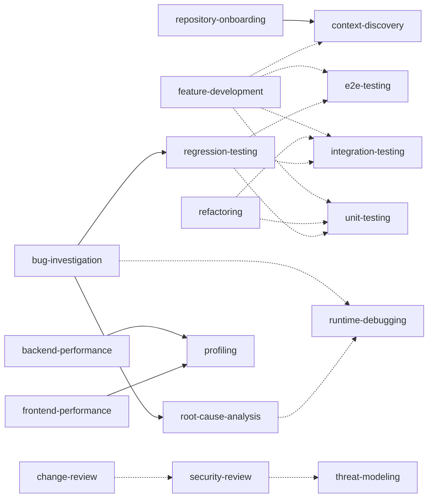

# Skill composition

Skills stay small by handing work to each other instead of repeating each other.
`bug-investigation` does not explain how to find a root cause or write a regression
test; it hands those steps to `root-cause-analysis` and `regression-testing`.

## Declaring dependencies

`skill.yaml` `depends_on` lists the skills a skill hands work to:

- `required`: the procedure cannot complete without it (`backend-performance` cannot
  work without `profiling`'s measurements).
- `optional`: used only in some situations (`feature-development` uses `e2e-testing`
  only when a claim is a user-visible flow).

The body names each dependency at the step that uses it; a test enforces that.
Workflows are a different mechanism: they sequence skills across phases of a change,
while `depends_on` is a hand-off inside one skill's procedure.

## Resolution

1. Dependencies are qualified ids and resolve against the effective set, with the same
   visibility rules as every reference ([references](references.md)): a Core skill
   depends only on Core skills; an adapter skill on Core and its own adapter.
2. A required dependency must exist. An optional dependency may be absent from the
   effective set; the step that would use it is skipped and the gap is recorded if it
   affects verification.
3. **Planned:** when a project disables a Core skill and adds a project skill with the
   same short name, dependencies on the Core skill resolve to the project skill. Until
   the CLI assembles the effective set, a disabled required dependency is reported.
4. A skill must not depend on a deprecated skill; it depends on the replacement.

## Ordering

Dependencies load when their step is reached ([progressive disclosure](progressive-disclosure.md)),
so ordering is the depending skill's procedure order. A dependency runs to its own
completion criteria and returns its result (a cause, a test, a measurement); the
calling skill continues from the next step. A dependency never takes over the calling
skill's remaining steps: `root-cause-analysis` reports the cause, and
`bug-investigation` writes the fix.

## No cycles

The dependency graph, required and optional edges together, must be acyclic
(`dependencyCycles`, tested over the Core catalog). A cycle means two skills each expect
the other to do part of the work, which is how procedures get skipped. Break it by
moving the shared step into one of them or into a third skill both depend on.

## Evidence across skills

An evidence record lists every skill that produced it in `producer.skills`. It must
satisfy each one: the union of their required check types (each must pass for completion;
a missing one is recorded as a gap) and
of their required evidence kinds (`assessSkillEvidence`).

## Core dependency graph

Solid arrows are required dependencies; dashed arrows are optional.
