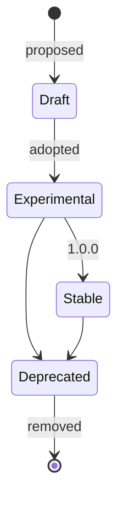

# Skills

A skill is a reusable procedure for one kind of engineering work. It says *how* to do
that work in any repository; the repository's code and Project Context say *what* is
true there. This page covers what a skill is made of, its contract, lifecycle,
versioning, customization and validation. How agents find and load skills:
[skill discovery](skill-discovery.md) and [progressive disclosure](progressive-disclosure.md).
How skills use each other: [skill composition](skill-composition.md). Decisions:
[ADR 0007](../decisions/0007-skill-format.md), [ADR 0014](../decisions/0014-skill-contract.md).

## Anatomy

```text
<category>/<name>/
├── SKILL.md      # Agent Skills frontmatter + the procedure        (required)
├── skill.yaml    # Paved contract: what tooling can check            (required)
├── references/   # Detail a step needs; loaded when the step says so (optional)
├── examples/     # Short synthetic examples of the output            (optional)
├── scripts/      # Deterministic helpers                             (optional)
└── assets/       # Templates the procedure fills in                  (optional)
```

`SKILL.md` follows the [Agent Skills specification](https://agentskills.io/specification)
exactly, so any compatible agent can use a Paved skill without Paved. Paved-specific
metadata cannot go in its frontmatter (the specification restricts the fields), so it
lives in `skill.yaml` next to it. There is one skill format; nothing else in Paved
defines skills.

| Part | Kind of content | Audience |
|---|---|---|
| Frontmatter `name`, `description` | Required metadata: identity and when to activate | Every agent, at startup |
| `SKILL.md` body | Procedural content: steps, decisions, criteria, failure modes | The agent that activated the skill |
| `skill.yaml` | Checkable metadata: id, version, status, context, tools, rules, dependencies, verification, evidence | Tooling, and agents resolving what to load |
| `references/`, `examples/` | Supporting material: detail and illustrations | The agent, when a step points to it |
| `scripts/`, `assets/` | Supporting material that is executed or copied | The agent, when a step says to use it |

No Core skill ships a script yet. A script is justified only when a step is
deterministic, repeated, error-prone by hand and technology-neutral; otherwise the
command belongs in a tool contract.

## SKILL.md contract

- Frontmatter: `name` equals the directory name; `description` (at most 1024 characters)
  says what the skill does **and when to use it**, with a phrase such as "Use when …",
  because the description is the only text an agent matches on before activating.
- Body sections, all required (from `core/templates/skill.md`): When to use, Required
  context, Preconditions, Procedure, Tools, Rules, Verification, Evidence, Completion
  criteria, Failure modes, References.
- At most 150 lines and 1500 words; supporting files at most 300 lines each. The Agent
  Skills limit is 500 lines; Paved keeps skills far smaller so an agent can hold one
  skill and the code it is working on at the same time.
- Every tool, rule and supporting file listed in `skill.yaml` is mentioned in the body,
  and every dependency is named at the step that uses it. The contract and the procedure
  cannot drift apart silently.
- No technology names, no project identifiers, no shell command blocks. Commands belong
  to tools and the verification profile; technology belongs to adapters; project facts
  belong to Project Context.

## skill.yaml contract

Schema: `schemas/skill.schema.yaml`.

| Field | Required | Meaning |
|---|---|---|
| `id` | yes | `<namespace>.<category>.<name>` ([references](references.md)) |
| `version` | yes | SemVer of this skill (see [versioning](#versioning)) |
| `status` | yes | `experimental`, `stable` or `deprecated` |
| `deprecation` | iff deprecated | `since`, `migration`, optional `replaced_by` |
| `category` | yes | One of the nine categories; equals the parent directory |
| `context.required` / `optional` | `required` yes | Context areas the skill reads |
| `tools.required` / `optional` | no | Tool ids; optional ones may be absent |
| `rules` | no | Rule ids the skill must respect beyond those applying by scope |
| `depends_on.required` / `optional` | no | Skills this one hands work to |
| `verification.required` / `recommended` | `required` yes | Check types that prove the outcome |
| `evidence.required` | yes | Evidence kinds a record must contain |
| `references` | no | Every supporting file, by path |

There are deliberately no tags, aliases or keyword lists: the description is the
matching surface for agents, and workflows map change types to skills. A second
matching mechanism would drift from the first.

### Required context and context resolution

A skill names context *areas* (`architecture`, `feature-map`, `verification`, …), never
paths or facts. The Core manifest's `context_areas` maps each area to where it lives in
a consumer (`verification` → `.paved/verification/profile.yaml`), and `technology`
includes the knowledge of the selected adapters. So a skill says "the verification
profile" and the agent resolves it in the repository it is working in.

Skills therefore contain no project knowledge. When a required area is missing, the
skill does not guess; the generic response is in `core/instructions/AGENTS.md` ("When a
skill cannot proceed"): record the gap, fall back to `context-discovery` if it can
recover the knowledge from the code, otherwise ask.

### Tools and rules

Tools and rules are referenced by qualified id, never copied. A required tool must exist
in the effective set; an optional tool may be missing (typically an adapter or the
project supplies it) and the skill says what to do without it. Rules are never
optional, and a test rejects a skill that copies a rule's statement.

### Verification, evidence and completion

- **Required** check types must each appear in the evidence as a passed check for
  completion. A missing type is recorded as a gap with a reason and leaves the task
  incomplete. A check type that supports no claim (for example `build`) cannot be
  required, because passing it proves nothing about the outcome; it can be recommended.
- **Recommended** types are run when the project's profile has them; their absence is
  not a gap. **Optional** checks are whatever else the agent judges useful; they need no
  declaration.
- Skills that change code (development, debugging, testing, performance) must require
  at least one check type and one evidence kind. Only skills that change nothing
  (discovery, analysis) may require none.
- Completion criteria are written as observable conditions, and wherever possible as
  conditions the evidence can show ("the regression test failed before the fix and
  passes after it"). `assessSkillEvidence` checks the machine-checkable part.

### Failure handling and unknowns

Failures common to every skill (missing context, unavailable tool, ambiguous
requirements, conflicting knowledge, failing verification, a blocking rule, insufficient
evidence) and the search order for unknowns (code and tests, history and configuration,
Project Context, documentation, then ask) are defined once in
`core/instructions/AGENTS.md`, which is always loaded. A skill's Failure modes table
lists only failures specific to its procedure.

## Lifecycle



| State | Where | Meaning |
|---|---|---|
| Draft | `.paved/generated/proposals/` (with a sidecar) or a pull request | Not a skill yet; nothing loads it |
| Experimental | Skill directory, `status: experimental`, version `0.x` | Usable; the procedure may change in a minor version |
| Stable | `status: stable`, version `>= 1.0.0` | Changes follow the version rules strictly |
| Deprecated | `status: deprecated` + `deprecation` | Still works; says what to use instead and since when |
| Removed | Gone; recorded in the changelog | References to it fail resolution |

All Core skills are experimental today.

## Versioning

Each skill has its own SemVer `version`, independent of the Core release that ships it,
because skills change at different speeds and a project reading a changelog needs to
know which skill changed incompatibly.

| Bump | When |
|---|---|
| Major | Purpose changed; new required context, tool, dependency or check type; removed step others rely on. Work that satisfied it before may not now |
| Minor | New optional context, tool, dependency or recommended check; new steps compatible with the existing procedure |
| Patch | Wording, examples, references that do not change what the skill asks for |

The schema ties version to status (`experimental` below 1.0.0, `stable` at or above).
The Core release version follows from the skill changes it contains
([versioning](versioning.md)).

## Customization

Projects never edit or copy a Core skill ([inheritance](inheritance.md)):

- **Extend** (preferred): an override with an addendum, read after the skill. Use it to
  add project-specific steps, point at project tools, or tighten criteria.
- **Disable and replace** (conservative): disable the Core skill with an owner and a
  reason, and add a project skill, which may reuse the short name. The project then
  owns that procedure entirely and receives no Core improvements to it.

There is no `replace` operation: a silent substitution would hide from reviewers that
the project no longer follows the Core procedure.

## Validation

| # | Check | Where |
|---|---|---|
| 1 | Frontmatter uses only Agent Skills fields; `name` matches directory; description length | `tests/skills/` |
| 2 | Every template section present | `tests/skills/` |
| 3 | `skill.yaml` valid (status/version/deprecation consistency included) | Schema |
| 4 | Id and category match the location; short names unique | `tests/skills/` |
| 5 | Tool, rule, skill and deprecation references resolve and respect visibility | `resolveReferences` |
| 6 | Dependency graph acyclic; no dependency on a deprecated skill | `dependencyCycles`, `tests/skills/` |
| 7 | Supporting files listed, present and one level deep | Schema, `tests/skills/` |
| 8 | Size, technology, identifiers, shell blocks, activation phrase, contract mentioned in body, no copied rules, change skills verifiable | `assessSkillQuality` |
| 9 | No required check type that proves nothing; no sentence duplicated across skills | `unprovingRequiredChecks`, `duplicatedSentences` |
| 10 | Evidence satisfies the skills that produced it | `assessSkillEvidence` |

Checks 1–9 run on every Core skill in `npm run check`; the CLI will run them on project
and adapter skills. Check 10 runs on evidence records. Fixtures in
`tests/fixtures/skills/` and `tests/fixtures/skill-evidence/` prove each check fails
when it should. None of these checks can tell whether a skill's advice is *good*; that
needs review and use.

## Catalog

The Core catalog is listed in `core/skills/README.md`.
