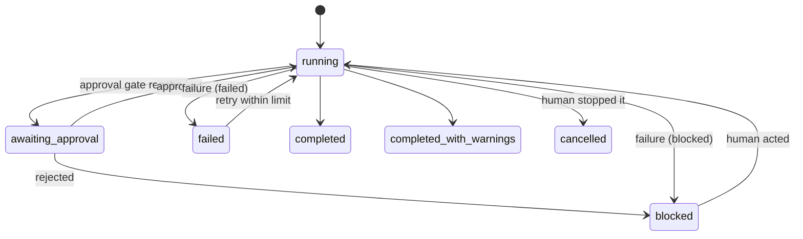

# Workflow state

A run of a workflow can be recorded as a `WorkflowRun` document
([schema](../../schemas/workflow-run.schema.yaml),
[template](../../core/templates/workflow-run.yaml)) under
`.paved/generated/runs/<id>.yaml`. It is a **record, not an engine**: nothing executes it,
no scheduler reads it, and no distributed state exists. An agent (or later a runner)
updates it as the run progresses so that a human, a reviewer or CI can see where a run
is, why it stopped and what it is waiting for.

## Model

| Field | Content |
|---|---|
| `workflow` | Id and version of the workflow run |
| `revision`, `started_at`, `ended_at` | Where and when; `ended_at` required for terminal statuses |
| `status` | `running`, `awaiting-approval`, `completed`, `completed-with-warnings`, `failed`, `blocked`, `cancelled` |
| `inputs[]` | Every input as understood, with `source` (`human`, `ticket`, `repository`) |
| `phases[]` | One per workflow phase, in order: `status` (`pending`, `running`, `completed`, `skipped`, `failed`, `blocked`), `attempts`, `skip_reason`, `skills[]`, `gates[]`, `failure` |
| `failure` | The failure that ended or holds the run ([workflow failure](workflow-failure.md)) |
| `warnings[]` | Required when `completed-with-warnings` |
| `evidence` | Path of the evidence record; required when completed |
| `outputs[]` | What the run left behind (`kind`, `description`, `ref`) |
| `events[]` | Append-only log |

## Consistency

The schema checks field-level rules (a failed or blocked run has a failure; a skipped
phase has a reason; a decided gate names a person). `assessRun` checks the record
against its workflow: the same version and phases in the same order, required inputs
present once work started, no phase started before earlier ones are done, skips only
where `skip_when` exists, attempts within the retry limit, gates known and satisfied the
right way, at most one running phase, and failure codes consistent with status and retry
class.

## Events

| Event | When |
|---|---|
| `run-started`, `run-completed`, `run-failed`, `run-blocked`, `run-cancelled` | Run transitions |
| `phase-started`, `phase-completed`, `phase-skipped`, `phase-failed` | Phase transitions |
| `skill-activated` | A skill is activated or continued |
| `tool-invoked` | A tool is used (`ref`: tool id) |
| `verification-executed` | A check ran (`ref`: check id in the evidence) |
| `evidence-recorded` | Evidence was written or appended |
| `approval-requested`, `approval-decided` | A human decision was asked for or made |
| `retry-started` | A new attempt of a phase began |

Events are for reporting and later automation (dashboards, CI annotations). They are
append-only and never the source of truth for completion: the evidence record is.

## Lifetime

Run records live under `.paved/generated/`, are disposable and are not committed by
default. The evidence record is what persists with the change. Teams that want an audit
trail can commit run records or attach them to the change request.
