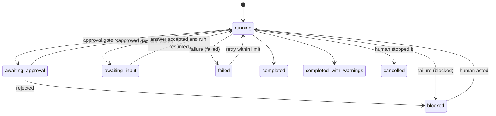

# Workflow state

A run of a workflow can be recorded as a `WorkflowRun` document
([schema](../../schemas/workflow-run.schema.yaml),
[template](../../core/templates/workflow-run.yaml)) under
`.paved/generated/runs/<id>.yaml`. The CLI now executes `feature`, `fix`, and
`refactor` by validating and advancing this record against the existing workflow
contract. An agent supplies observations and implementation changes; the runtime
enforces plan approval, invokes the governed testing Tool and verification
engine, and requires complete workflow evidence before completion. There is no
distributed scheduler.

## Model

| Field | Content |
|---|---|
| `workflow` | Id and version of the workflow run |
| `revision`, `started_at`, `ended_at` | Where and when; `ended_at` required for terminal statuses |
| `status` | `running`, `awaiting-approval`, `awaiting-input`, `completed`, `completed-with-warnings`, `failed`, `blocked`, `cancelled` |
| `inputs[]` | Every input as understood, with `source` (`human`, `ticket`, `repository`) |
| `phases[]` | One per workflow phase, in order: `status` (`pending`, `running`, `completed`, `skipped`, `failed`, `blocked`), `attempts`, `skip_reason`, `skills[]`, `gates[]`, `failure` |
| `failure` | The failure that ended or holds the run ([workflow failure](workflow-failure.md)) |
| `warnings[]` | Required when `completed-with-warnings` |
| `evidence` | Path of the evidence record; required when completed |
| `outputs[]` | What the run left behind (`kind`, `description`, `ref`) |
| `events[]` | Append-only log |
| `decisions[]` | Run-scoped decisions whose lifetime is this run |

## Consistency

The schema checks field-level rules (a failed or blocked run has a failure; a skipped
phase has a reason; a decided gate names a person). `assessRun` checks the record
against its workflow: the same version and phases in the same order, required inputs
present once work started, no phase started before earlier ones are done, skips only
where `skip_when` exists, attempts within the retry limit, gates known and satisfied the
right way, at most one running phase, and failure codes consistent with status and retry
class.

## Events

| Event | When |
|---|---|
| `run-started`, `run-completed`, `run-failed`, `run-blocked`, `run-cancelled` | Run transitions |
| `phase-started`, `phase-completed`, `phase-skipped`, `phase-failed` | Phase transitions |
| `skill-activated` | A skill is activated or continued |
| `tool-invoked` | A tool is used (`ref`: tool id) |
| `verification-executed` | A check ran (`ref`: check id in the evidence) |
| `evidence-recorded` | Evidence was written or appended |
| `approval-requested`, `approval-decided` | A human decision was asked for or made |
| `decision-raised`, `decision-asked`, `decision-answered`, `decision-applied`, `decision-superseded` | A run-scoped decision changes state |
| `retry-started` | A new attempt of a phase began |

## Plan approval

Planning writes an `awaiting-approval` gate tied to the SHA-256 digest of the
concrete plan file. The decision lives in `.paved/approvals/<run-id>.json` with
`run`, `plan_sha256`, `decision` (`approved` or `rejected`), `decided_by`, and
`decided_at`. The user approves in the conversation; after an explicit yes, the agent
runs the workflow with `--run <run-id> --approve`, which records the approval for the
current plan digest under the local user and resumes. A person may also write the file
directly, for example to reject. The runtime checks the file, decision, plan content
and recorded gate on every resume, and `--approve` refuses when the plan changed since
the request. The record rests on the agent following the instruction to approve only
after an explicit yes; teams requiring adversarial approval separation need an external
identity or signature authority.

For workflow Markdown plans, the canonical file is
`.paved/documents/plans/<run-id>.md`; `paved preview start
.paved/documents/plans/<run-id>.md` opens a local review, and a folder opens its
Markdown files together. Selected-text comments remain in
`.paved/generated/previews/`; the agent waits for them, marks each as being worked on
and resolves it with a reply after editing. The preview approves nothing. If the plan
changes during review, advancing the workflow issues a new approval request for its
current hash.

Events are append-only reporting and provenance. Approval and evidence events
are cross-checked against their referenced files when a run resumes. The
authoritative completion decision still comes from the evidence record.

## Lifetime

Run records and local evidence live under `.paved/generated/`, are disposable and are
not committed by default. Durable plans and other work documents live under
`.paved/documents/` and are committed with the change. Teams that want a machine-readable
audit trail can commit run records or attach them to the change request.
