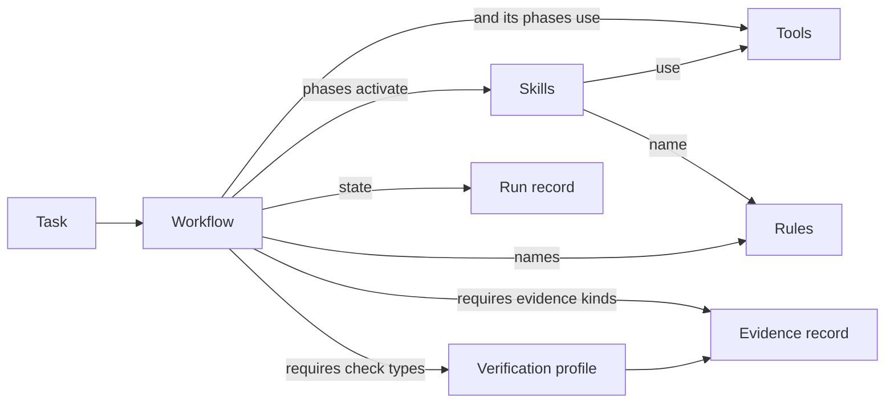

# Workflows

A workflow carries one class of change from request to verified completion. The Core
ships three: `feature`, `bug` and `refactor`. A performance improvement runs as `refactor`
(behavior unchanged) or `feature` (a new budget); the `performance`, `incident` and
`release` workflows were removed in Core 2.0 because nothing executed them
([ADR 0036](../decisions/0036-intent-plan-execute.md)). It is an
orchestration layer: it decides **which** phases run, **which** skills each phase
activates, **which** checks prove the result and **where** a human must decide. It never
says **how** to do the work; skills do. It never says what must hold; rules do. It
never runs a command; Checks name Tool capabilities, and a separate implementation
binding supplies an execution mechanism.

## Architecture

| Part | Where | Role |
|---|---|---|
| Contract | `workflow.yaml` ([schema](../../schemas/workflow.schema.yaml)) | What the run needs, does and must prove, as checkable data |
| Guidance | `WORKFLOW.md` (sections: When to use, Phases, Escalation; at most 80 lines) | Judgement calls the contract cannot express |
| Execution semantics | [`core/instructions/workflows.md`](../../core/instructions/workflows.md) | How any agent runs any workflow: preconditions, gates, failures, retries, completion |
| Run state | `.paved/generated/runs/<id>.yaml` ([schema](../../schemas/workflow-run.schema.yaml)) | What happened in one run ([workflow state](workflow-state.md)) |
| Checks | `cli/lib/workflows.ts` | Rules the schemas cannot express |

Execution semantics are written once, for all workflows, so each `WORKFLOW.md` stays
short and workflows cannot disagree about what `blocked` means.

## Contract

| Group | Fields | Notes |
|---|---|---|
| Required metadata | `id`, `title`, `description`, `version`, `status`, `change_type` | `description` says "Use when …"; `change_type` is the trigger |
| Optional metadata | `deprecation` (only when `deprecated`), `references` | Same lifecycle model as skills ([versioning](versioning.md#workflow-versions)) |
| Inputs | `inputs[] {id, description, required}` | A missing required input stops the run (`input-missing`); inputs are never invented |
| Context | `context {required, optional}` | Context areas, resolved through the manifest's `context_areas` |
| Preconditions | `preconditions[] {id, condition}` | Workflow-specific; the standard ones apply to every run |
| Execution configuration | `phases[]`: `phase`, `goal`, `skills`, `tools`, `verification`, `gates`, `skip_when`, `retry` | [Workflow stages](workflow-stages.md) |
| Rules | `rules[]` | Rules every run respects, besides those selected by `applies_to` |
| Completion | `evidence.required`, `outputs`, `completion.criteria` | Criteria add to the standard completion rule; they never relax it |

Deliberately absent: commands, paths, technologies, project names, and any field that
repeats a skill's procedure. A workflow names skills, tools, rules, check types and
evidence kinds by id or key.

## Skill composition

Phases list skills in activation order. A skill listed in several phases is activated
once and continued in later phases: `bug-investigation` spans discovery, planning and
implementation, and the phases mark where its gates sit. Skills activate their own
dependencies at the step that needs them ([skill composition](skill-composition.md)),
so a workflow must not list a skill that another listed skill already brings in as a
required dependency; the check reports it as duplicate activation. A missing required
skill fails reference resolution; an inapplicable skill is recorded as not applicable
in the run. Cycles are impossible because the skill graph is acyclic and phases only
move forward. At most three skills per phase: more means the phase is doing two things.

**No workflow composition.** Workflows do not invoke other workflows. A request that
mixes kinds of change is split by `intent` into separate runs, each with its own
classification. Nested runs would need shared state, nested failures and nested
approvals; the evidence of two separate runs is easier to review
([ADR 0015](../decisions/0015-workflow-contract.md)).

**Every Core workflow must be executable.** Every gate in a Core workflow contract has a
handler in `cli/lib/workflow-gates/`, and `tests/workflows/gates.test.ts` walks the Core
workflows to enforce it. A gate or workflow added to the Core fails that test until it
has handlers, so the Core never ships a contract nothing executes. Project workflows in
`.paved/workflows/` are guidance and are not executed.

## Rule resolution

A run respects the union of: the workflow's `rules`, the `rules` of every activated
skill, and every rule whose `applies_to` matches the change (paths, workflow id, change
type, adapter). Then overrides apply as in [inheritance](inheritance.md): Core, then
adapter, then project rules, then project overrides (`set-severity`, `disable`, never for
`overridable: false`). Listing a rule in a workflow does not change its severity. A
violated `error` rule blocks completion (`rule-violation`); a violated `warning` rule
makes the run `completed-with-warnings`.

## Tool resolution

A phase may use the tools it lists and those of its active skills. Required tools must
resolve; optional ones may be absent, and the step that needs them uses its fallback.
Tool safety holds through the workflow: a phase that can reach a `destructive` tool must
carry an approval gate and must not be retried automatically (checked). A Check names a
Tool capability. Tool resolution selects one compatible Core, adapter or explicitly
selected project implementation; discovery does not grant permission to execute it.

## Verification and evidence

Verification is a phase of its own that cannot be skipped. Each phase may name
`verification.required` check types (each must pass for completion; a missing type is
recorded as a gap) and
`recommended` ones. A workflow that has an implementation phase must require at least one
check type in `verification` and at least one evidence kind, and a required check type
must be able to prove some claim (`build` cannot). The evidence record names the
workflow in `producer.workflow`; `assessWorkflowEvidence` checks it holds every required
check type of every phase and every required evidence kind, and `assessSkillEvidence`
does the same for the activated skills.

## Completion and outputs

| Outcome | Run status | Evidence `completion.status` |
|---|---|---|
| Completed | `completed` | `complete` |
| Completed with warnings | `completed-with-warnings` (warnings listed) | `complete`, with recommended omissions or warning rules |
| Failed | `failed` | `incomplete` |
| Blocked | `blocked` | `blocked` |

`outputs` declares what a completed run leaves: `change`, `evidence`, `review`,
`measurement`, `release-candidate`, `follow-up`, `context-update`. Failures, retries and
approvals are in [workflow failure](workflow-failure.md) and
[workflow approval](workflow-approval.md).

## Checks

| Check | Where |
|---|---|
| Required fields, phase shape, unskippable phases, retry shape, lifecycle status | Schema |
| Canonical order, unique gates, "Use when", no technology names, size, contract mentioned in `WORKFLOW.md` | `assessWorkflowQuality` |
| Verification required for code changes; required checks can prove something | `assessWorkflowQuality` |
| Destructive tools gated and not auto-retried; a `release` or `incident` change type carries its approval | `assessWorkflowQuality` |
| No duplicate activation; no deprecated skills; no sentences copied from skills | `assessWorkflowQuality` |
| Skills, tools and rules resolve | `resolveReferences` |
| Run records match their workflow | `assessRun` |
| Every Core gate has a handler | `tests/workflows/gates.test.ts` |
| Evidence satisfies the workflow | `assessWorkflowEvidence` |

## Influences

The contract borrows from established practice without depending on any of it:
explicit phases with human checkpoints where agents act on shared systems (Anthropic,
"Building effective agents"); retry classes with bounded attempts and non-retryable
errors (durable-execution retry policies); approval gates on deployment environments
(CI/CD protected environments); and incident phases of detection, containment,
recovery and follow-up (NIST SP 800-61).
